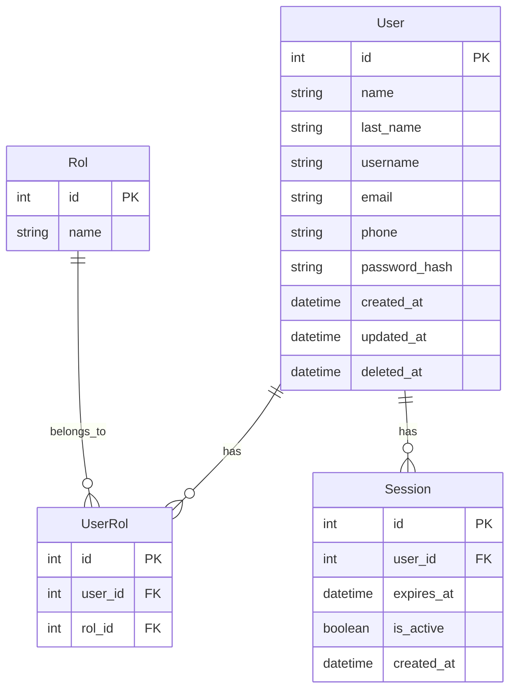

# Arquitectura del Proyecto

Este documento describe la arquitectura técnica y el modelo de datos de la plantilla Alquimia.

## Modelo de Datos (ERD)

## Componentes Técnicos

### Mixins (Abstract Models)

Los modelos de SQLAlchemy heredan de varios mixins para estandarizar comportamientos:

- **DateTimeMixin**: Añade automáticamente `created_at` y `updated_at`.
- **SoftDeleteMixin**: Implementa eliminación lógica mediante la columna `deleted_at`.
- **PasswordMixin**: Gestiona el hashing de contraseñas de forma automática y segura.

### Controladores

- **UserController**: Gestiona el registro y la recuperación de perfiles de usuario.
- **SessionController**: Encargado de la lógica de autenticación (login/logout) y validación de tokens/sesiones.

### Configuración de Base de Datos

La base de datos se inicializa dinámicamente basándose en la clase `ConnectionData`, que soporta múltiples dialectos (MySQL, SQLite) a través de variables de entorno.

### Interfaz de Usuario

Aunque el enfoque es backend, el proyecto incluye un "runner" basado en **wxPython** para una gestión administrativa básica local (Login, Registro y Ventana Principal).
