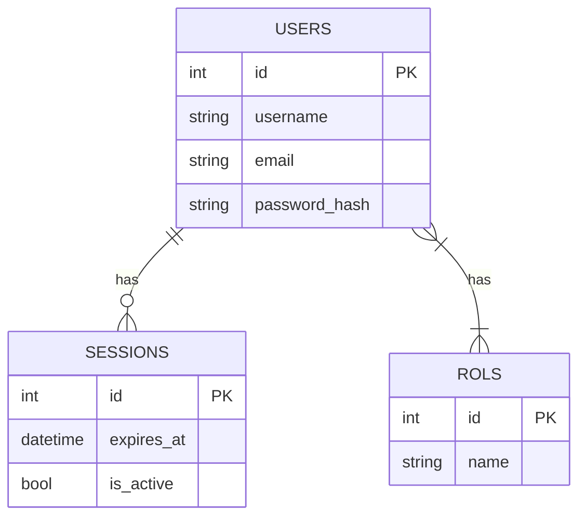

# Documentación de Base de Datos (Alquimia 2.0)

Este documento describe el esquema de base de datos estándar incluido en la plantilla.

## Diagrama ER

## Modelos Core

### 1. `User` (Usuarios)
Tabla: `users`
Representa a cualquier actor que interactúa con el sistema.
- **Campos**:
  - `id`: Identificador único.
  - `name`, `last_name`: Información personal.
  - `username`, `email`: Credenciales de acceso (Unique).
  - `phone`: Contacto opcional.
  - `password`: Hash de la contraseña (gestionado por `PasswordMixin`).
- **Mixins**: `DateTimeMixin`, `SoftDeleteMixin`.

### 2. `Rol` (Roles)
Tabla: `rols`
Define los niveles de acceso del sistema.
- **Campos**:
  - `name`: Nombre del rol (ej. 'admin', 'user').
- **Relaciones**:
  - Muchos a Muchos con `User` a través de la tabla pivote `user_rols`.

### 3. `Session` (Sesiones)
Tabla: `sessions`
Controla la seguridad y el acceso activo.
- **Campos**:
  - `expires_at`: Fecha/hora de expiración del token/sesión.
  - `is_active`: Booleano para invalidar sesiones forzosamente.
- **Relaciones**:
  - Pertenece a un `User`.

## Tablas Pivote

### `user_rols`
Tabla intermedia para la relación N:M entre Usuarios y Roles.
